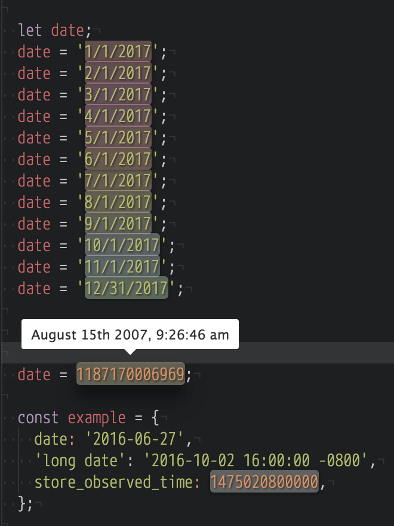

# Atom Date-Helpers

Adds date highlighting and conversion to Atom.



## Notes

Dates accept any valid [Moment.js]() format. Dates are slightly highlighted between the following colors along a scale (1/4th a year):

```sass
#F3B1CB, #F0ACA8, #FFC9AD, #F2E1AC, #E0F7D2, #DDEDF8, #7484DA
```

## Caveats

- The highlights do not persist as there is currently no way to find the range of a given scope selector. When this API lands, I will fix this, otherwise we would need to build our own parser like [pigments](https://github.com/abe33/atom-pigments), but that is buggy.
